When working on a Project, the last thing you need is to work with tools that you are not familiar with.  In most cases, the project deadlines are very tight and this prevents you from spending time to learn new things and Maven ([Homepage](http://maven.apache.org/)) is not an exception.  While this can keep you away from Maven, or other tooling technologies, this article will show you the contrary.  Maven is a good tool that, once understood, can help you save time even with simple projects.

This article assumes you have no knowledge about Maven or other build tools such as Gradle ([Homepage](https://gradle.org/)).  While this is not a must, you should have a good understanding of the software development lifecycle and what is required to build a Java application.  This will help you understand better how Maven can assist you while developing and deliverying software.  In order to visualise some of the benefits, we will develop a small Java Swing application without using Maven and then with Maven.  This is done for several reasons.  One of the reasons is to show you how simple Maven is to use.  More importantly, it will show how Maven can be used to carry out all the annoying and repetitive tasks and thus making you more productive.

All code listed below is available at: [https://github.com/javacreed/why-should-we-use-maven](https://github.com/javacreed/why-should-we-use-maven).  Most of the examples will not contain the whole code and may omit fragments which are not relevant to the example being discussed.  The readers can download or view all code from the above link.

Let start by understanding what is Maven and what it can bring to the table.

## What is Maven and why it is used?

When building software projects, you need to perform the following tasks irrespective of the development methodology used.

1. Gather requirements
1. Analyse requirements
1. Design solution
1. Develop (code) solution
1. Test solution
1. Deploy solution
1. Maintain solution

The above tasks are usually executed in the order listed above.  For example, you cannot develop a solution before you understand and analyse the requirements and design a solution that addresses this problem.  Another approach is to use Test Driven Development ([Book](http://www.amazon.com/Test-Driven-Development-Kent-Beck/dp/0321146530)), where the test cases are created before the solution is developed.

While all the thinking must be done by the team of humans, the repetitive steps can be carried out by an assistant, if we may.  The assistant is not intelligent but knows the software development flow and how to do basic things.  For example, the assistant can create the projects based on templates, download required third party libraries (also known as JARs) and their dependencies too, build all components and create a deployable JAR, WAR or EAR file.  Furthermore, the assistant can be empowered with new skills as the journey proceeds.  This assistant is called Maven.  This distinguishes Maven from other building tools such as Ant ([Homepage](http://ant.apache.org/)) or other build scripts.  

Before we dive in more detail about Maven, lets first create a simple project using only Spring Tool Suite ([Homepage](http://spring.io/tools)).

## The Demo Project

To demonstrate the benefits of Maven, we will use a simple Java Swing application that requires the following:

1. Use a splash-screen
1. Use the following third party libraries:
    1. Apache Commons Lang 3 ([Homepage](http://commons.apache.org/)) as a utilities library
    1. JUnit ([Homepage](http://junit.org/)) as a testing library
1. Create a runnable JAR
1. The test classes and libraries should be excluded from the final JAR

The project consists of four classes:

1. `Main` class
1. `Application` class
1. `Calculator` class
1. `CalculatorTest` test class

We will start by first developing the project using just the IDE.  We will go through all the steps required to meet the requirements listed above.  Then we will rebuild the same project using Maven to illustrate how Maven can help.

## Developing the Project without Maven

The project starts as shown next.

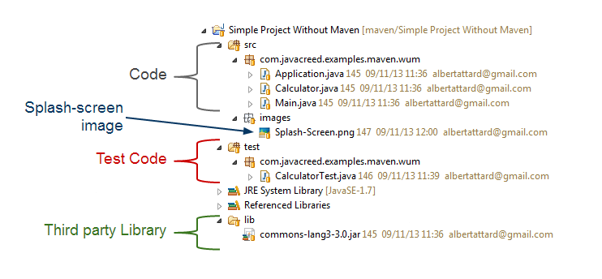

The project shown above has two source folders one called `src` and the other one called `test`.  Also, we have another folder with all third party libraries called `lib`.  Our code depends on this library and without it, it will not compile.  In order to simplify the processes we included the dependencies in the `lib` folder.

Let us start modifying the project to meet our requirements.  We need to create a file called `MANIFEST.MF` under the `META-INF` folder and add the following entries:

```
Manifest-Version: 1.0
Main-Class: com.javacreed.examples.maven.wum.Main
Class-Path: . lib/commons-lang3-3.0.jar
SplashScreen-Image: images/Splash-Screen.png

```

The manifest file shown above takes care of three things.

1. It indicates the main class.  When the user double click on the JAR file this class is executed and the program starts.

    ```
    Main-Class: com.javacreed.examples.maven.wum.Main
    ```

1. It defines the libraries that this program needs.

    ```
    Class-Path: . lib/commons-lang3-3.0.jar
    ```

    Note that the `Class-Path` starts with a `.` (dot) and is followed by the relative path of the third party library: `lib/commons-lang3-3.0.jar`

1. Finally it defines the splash-screen to be used

    ```
    SplashScreen-Image: images/Splash-Screen.png
    ```

Note that the manifest has an empty line at the end as shown below.  

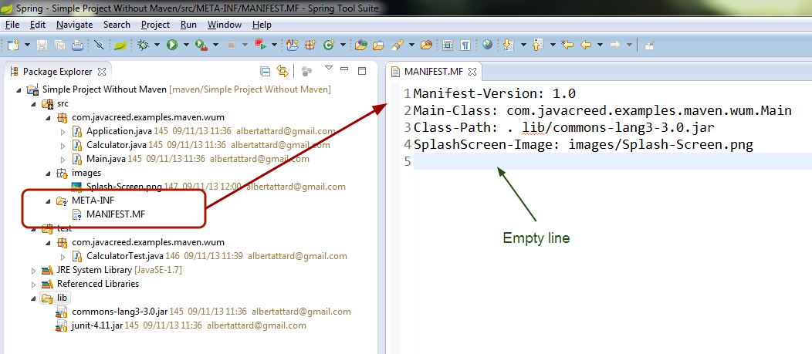

Testing this application is very simple.  All we need to do is add the JUnit library through STS and then run the test code.  The JUnit library can be added in four steps as shown next.

1. Right click on the project, then select `Properties` as shown below.

    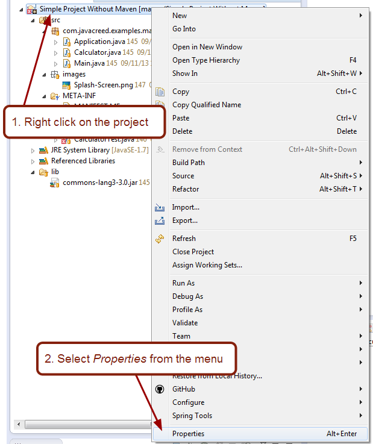

    This will open the project properties dialog.

1. Select the `Java Build Path` and then the `Libraries` tab.   Click on the `Add Library ...` button.

    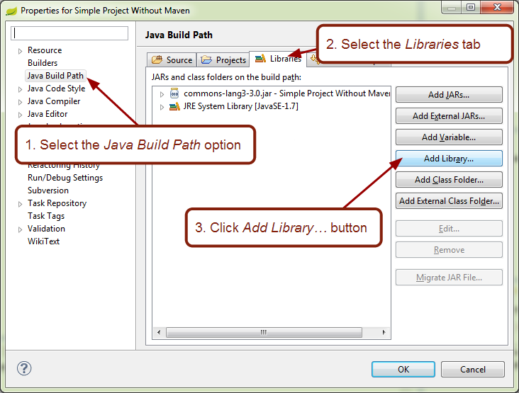

    This will open the add library dialog.

1. Select `JUnit` and press the `Next` button

    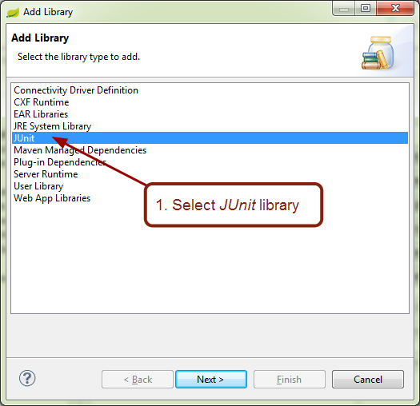

1. Select version 4 of the JUnit library and click the `Finish` button

    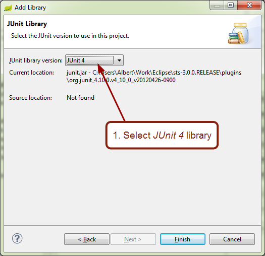

Now STS knows that it needs to use JUnit and it will make all necessary arrangements for that.  We can now run the tests as shown below.

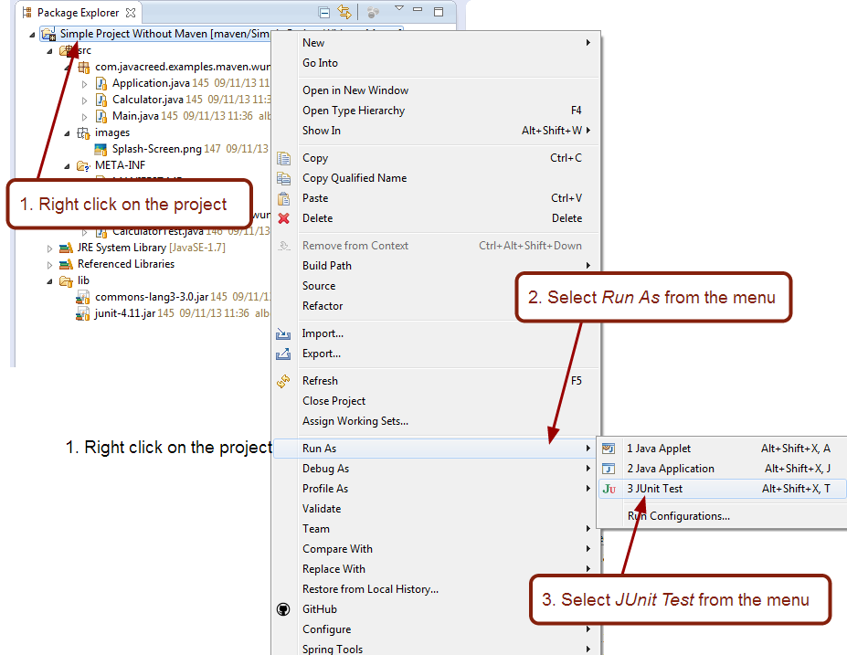

Running the actual tests is very straight forward.  Simply run the project as `JUnit Test`.  The tests should pass and the following output shown in the `JUnit` tab.

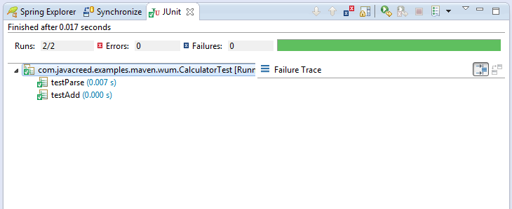

Note that the tests will not run automatically and you need to remember to run them whenever the code is modified.   The application is now tested and ready to be deployed.  All we need to do is to create a runnable JAR file that shows a splash-screen when starting. The following steps will guide us through.

1. Right click on the project and select `Export`

    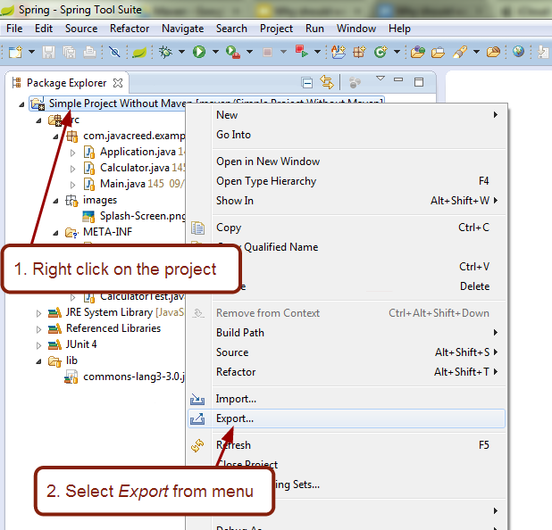

    This will open the export dialog.

1. Select the `JAR file` option and click the `Next` button.

    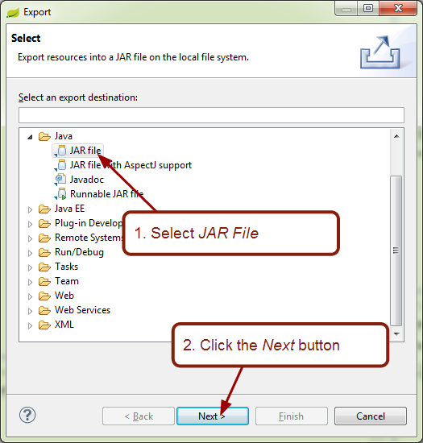

    Do not select the `Runnable JAR file` option as this will replace our manifest and will lose all changes.  Furthermore, we cannot add a splash-screen through this option.

1. Select both the `src` and `lib` folders and provide a path where the JAR file will be created.

    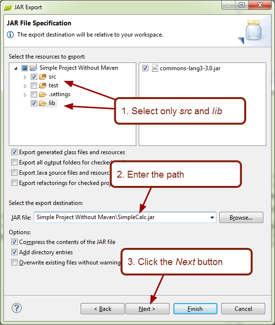

    Make sure that the JAR file is exported to the same path where the `lib` directory is.  The manifest refers to the third party libraries through a relative path.

1. Click the `Next` button to proceed to the final window

    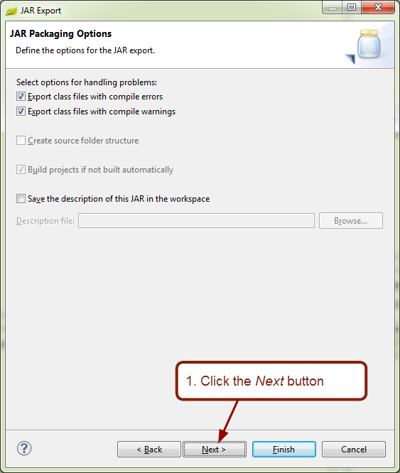

1. In the last window, select the `Use existing manifest from workspace` and provide its path.  Then click the `Finish` button to complete the process.

    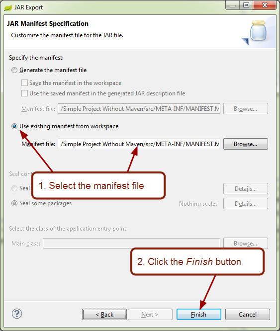

This will produce our runnable JAR file in the provided path.   The above steps need to be executed every time we need to create a runnable JAR.  Furthermore, we need to update the manifest file whenever we need to use other third party libraries.  Note that all efforts described here are not code related.  We did not change any of the code.  We simple tested it and created a runnable JAR.

We saw how to achieve our simple requirements without using Maven.  In the next section we will do the same but only this time use Maven.

## Developing the Project with Maven

We will start of with the same project only the layout is slightly different to benefit from Maven's default configuration and thus simplifying things further.  With that said we can achieve the same results using the same layout by modifying Maven's configuration.


Note that `lib` folder is missing as this is not required as Maven will manage all dependencies.  In this simple example we only have one dependency that does not depend on anything else.  In more complex projects, we may have dependencies that depend on other dependencies.  We have to resolve all dependencies ourselves if we are to work without Maven.

Maven requires a configuration file per project called `pom.xml` ([Documentation](http://maven.apache.org/pom.html)).  In this file we will enter all our configuration as shown next.

```xml
<project xmlns="http://maven.apache.org/POM/4.0.0"
  xmlns:xsi="http://www.w3.org/2001/XMLSchema-instance"
  xsi:schemaLocation="http://maven.apache.org/POM/4.0.0 http://maven.apache.org/xsd/maven-4.0.0.xsd">

  <modelVersion>4.0.0</modelVersion>

  <groupId>com.javacreed.examples</groupId>
  <artifactId>why-should-we-use-Maven</artifactId>
  <name>Why should we use Maven?</name>
  <url>http://www.javacreed.com/why-should-we-use-maven/</url>
  <version>0.0.1-SNAPSHOT</version>

  <properties>
    <project.build.sourceEncoding>UTF-8</project.build.sourceEncoding>
  </properties>

  <build>
    <plugins>
      <plugin>
        <artifactId>maven-compiler-plugin</artifactId>
        <version>2.3.2</version>
        <configuration>
          <source>1.7</source>
          <target>1.7</target>
        </configuration>
      </plugin>
      <plugin>
        <artifactId>maven-assembly-plugin</artifactId>
        <configuration>
          <finalName>SimpleCalc</finalName>
          <appendAssemblyId>false</appendAssemblyId>
          <archive>
            <manifest>
              <addClasspath>true</addClasspath>
              <mainClass>com.javacreed.examples.maven.um.Main</mainClass>
            </manifest>
            <manifestEntries>
              <SplashScreen-Image>images/Splash-Screen.png</SplashScreen-Image>
            </manifestEntries>
          </archive>
          <descriptorRefs>
            <descriptorRef>jar-with-dependencies</descriptorRef>
          </descriptorRefs>
        </configuration>
        <executions>
          <execution>
            <id>make-my-jar-with-dependencies</id>
            <phase>package</phase>
            <goals>
              <goal>single</goal>
            </goals>
          </execution>
        </executions>
      </plugin>
    </plugins>
  </build>

  <dependencies>
    <dependency>
      <groupId>org.apache.commons</groupId>
      <artifactId>commons-lang3</artifactId>
      <version>3.0</version>
    </dependency>
    <dependency>
      <groupId>junit</groupId>
      <artifactId>junit</artifactId>
      <version>4.11</version>
      <scope>test</scope>
    </dependency>
  </dependencies>
</project>
```

The pom file shown above may seem too complex but it is not as complex as one may think.  The configuration file is XML based and thus it is quite verbose.  Let's break it in smaller pieces and go through the file piece by piece:

1. The first plugin defines our Java compiler version.   This will make sure to use the correct compiler when building our classes.

    ```xml
          <plugin>
            <artifactId>maven-compiler-plugin</artifactId>
            <version>2.3.2</version>
            <configuration>
              <source>1.7</source>
              <target>1.7</target>
            </configuration>
          </plugin>
    ```

1. The second plugin is the assembly plugin.  This plugin is responsible from creating the runnable JAR file.  This plugin also generates the manifest file and sets the main class together with the splash-screen.

    ```xml
          <plugin>
            <artifactId>maven-assembly-plugin</artifactId>
            <configuration>
              <finalName>SimpleCalc</finalName>
              <appendAssemblyId>false</appendAssemblyId>
              <archive>
                <manifest>
                  <addClasspath>true</addClasspath>
                  <mainClass>com.javacreed.examples.maven.um.Main</mainClass>
                </manifest>
                <manifestEntries>
                  <SplashScreen-Image>images/Splash-Screen.png</SplashScreen-Image>
                </manifestEntries>
              </archive>
              <descriptorRefs>
                <descriptorRef>jar-with-dependencies</descriptorRef>
              </descriptorRefs>
            </configuration>
            <executions>
              <execution>
                <id>make-my-jar-with-dependencies</id>
                <phase>package</phase>
                <goals>
                  <goal>single</goal>
                </goals>
              </execution>
            </executions>
          </plugin>
    ```

    Furthermore, this plugin packs all dependencies as one JAR file.  This means that we will end up with one JAR file and all dependencies code will be copied into this JAR file.  Note that this may not work well with all projects and dependencies.  If two different dependencies have entries with the same paths, then one will replace the other and may break the code.  

1. Finally we define our dependencies.  This project only has two dependencies and one of them is only required for testing as defined by its scope.

    ```xml
        <dependency>
          <groupId>org.apache.commons</groupId>
          <artifactId>commons-lang3</artifactId>
          <version>3.0</version>
        </dependency>
        <dependency>
          <groupId>junit</groupId>
          <artifactId>junit</artifactId>
          <version>4.11</version>
          <scope>test</scope>
        </dependency>
    ```

With Maven we can test and deploy our program using Maven's goals as shown next

1. Right click on the project and select the `Run As` option.  Then select the `4 Maven Build` option.

    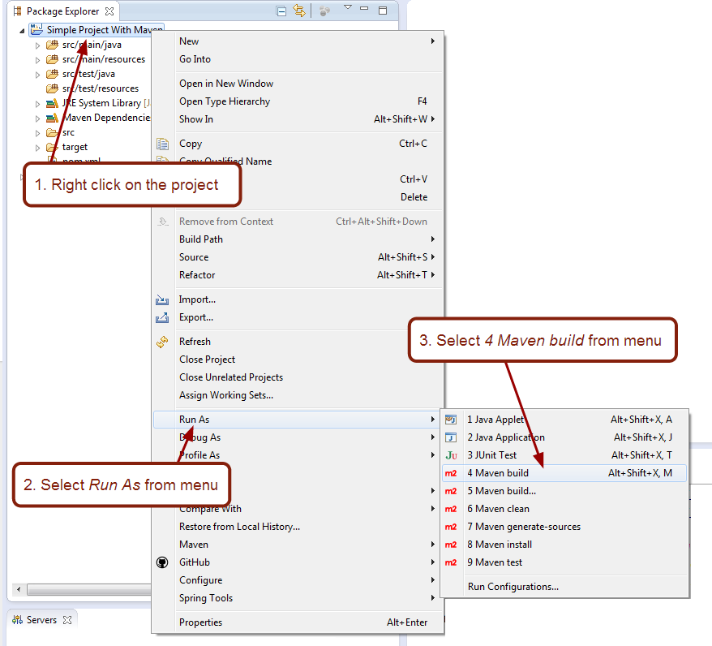

    This will open the edit configuration dialog.

1. Enter the Maven goals (commands to be executed by Maven)

    ```
    clean install
    ```

    and click the `Run` button.

    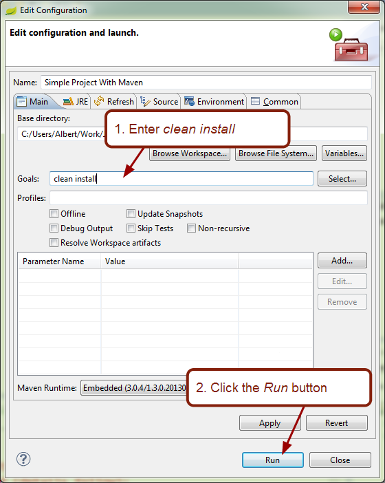

Maven will do its magic and will test and produce our runnable JAR file.  In just two steps we managed to test and create a runnable JAR file.  Maven, using the configuration in the pom file, performed the following:

1. Added the third party libraries
1. Run the tests
1. Created the `MANIFEST.MF` file with the correct entries
1. Packaged everything into one runnable JAR file

We can run this as many times as we need.  Furthermore, STS provides a set of hotkeys: `ALT`+`SHIFT`+`X` followed by `M`.  We do not have to provide the Maven goals the next time we run it as STS will remember them from our previous run.

Note that when using Maven, we did not prepare a MANIFEST.MF file.  This is partially true as we instructed Maven to do it for us.  If we require new dependencies (third party libraries), Maven will take all the necessary actions to include these in the deployed JAR file.

As you saw, all it takes are two steps to rebuild, test and produce a runnable JAR file using Maven when compared with the many steps we had to perform when we did not use Maven.  In the next section we will see more about Maven and how we can benefit from using it.

## Maven

Maven, different from other build tools, knows the software development life cycle.  It knows that testing need to be executed after the code is compiled and not before.  Test code and other third party libraries used only for testing are only required during testing and thus these should not be part of the final product and Maven leaves them out when packaging the application.  Maven knows from where to download any third party libraries and their dependencies.  Any third party libraries used needs to be also available at runtime.  Maven provides several options how this can be achieved.  As you can see from the pom file listed above, we did not tell Maven any of this.  All we added were specific things required by our project, such as using a splash-screen.

When Maven is used for the first time, it downloads many plugins ([Available Plugins](http://maven.apache.org/plugins/)) that it requires to perform the given tasks.  This is because the default installation will only come with the bare minimum and everything else is downloaded as required.  Anyone can contribute to make Maven better and more suitable for their needs through plugins.  Plugins can be added as needed and projects configuration can be shared between multiple projects thus minimise the configuration required for each new project.  Furthermore, there already exists a large number of Maven plugins for various tasks, such as packing an application into a single JAR file, database updates ([Documentation](http://mojo.codehaus.org/dbupgrade/dbupgrade-maven-plugin/)) and deploying a Web application to a Tomcat server ([Documentation](http://tomcat.apache.org/maven-plugin-2.0/tomcat7-maven-plugin/)) and many more.

Maven is a tool that can help in creating, building, publishing and managing dependencies for many applications.  Maven is not bound to Java ([Homepage](http://www.java.com/)) and it can be used with other programming languages such as PHP ([Homepage](http://php.net/)).  It is very easy to use and definitely worth its money (note that Maven is free) when compared with the time saved from doing the repetitive things ourselves.
